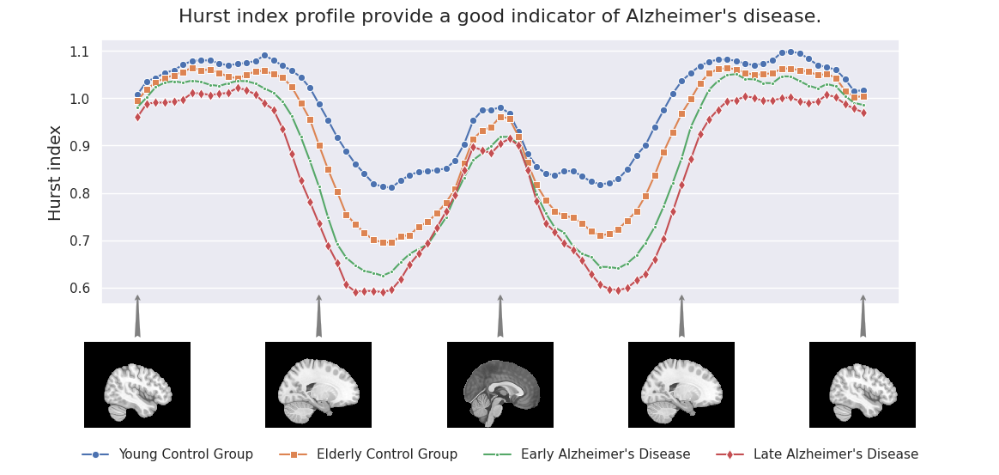

### Description

A feasibility study of usefulness of fractal-aware datasets in identifying Alzheimer's disease.

### Dataset

Dataset used in this study comprises of a set of Hurst exponents calculated using the [mfmri pipeline](https://github.com/Mark-Kac-Center/mfmri) on the [OASIS-1](https://www.oasis-brains.org/) data for structural MRI scans.

Because the dataset is unbalanced, several resampling method were used (from the *imblearn* package):
- oversampling with SMOTE
- random oversampling
- random undersampling
- combined over-under sampling with SMOTENN

### Models

Models used:
- k-nearest neighbor (*sklearn.neighbors.KNeighborsClassifier*)
- support vector classifier (*sklearn.svm.SVC*)
- gradient boost decision tree (*lgbm.LGBMClassifier*)

all trained within a [nested cross-validation](https://scikit-learn.org/stable/modules/cross_validation.html) scheme.

### Results

| resampling   | model   |   accuracy |   F1 score |   MCC |   MCC perm. |
|:------------------|:--------|-----------:|----------:|-----------:|-----------:|
| over_smote        | lgbm    |      0.545 |     0.397 |      0.149 |      0.01  |
| none              | svc     |      0.579 |     0.37  |      0.14  |      0.03  |
| over_smote        | svc     |      0.541 |     0.369 |      0.106 |      0.03  |
| combine_smotenn   | knn     |      0.253 |     0.228 |      0.081 |      0.02  |
| over_random       | knn     |      0.464 |     0.369 |      0.099 |      0.069 |

The best classifier is the gradient boosted decision tree lgbm.

### Packages used in the study
* scikit-learn
* lgbm
* [imbalanced-learn](https://imbalanced-learn.org/stable/)
